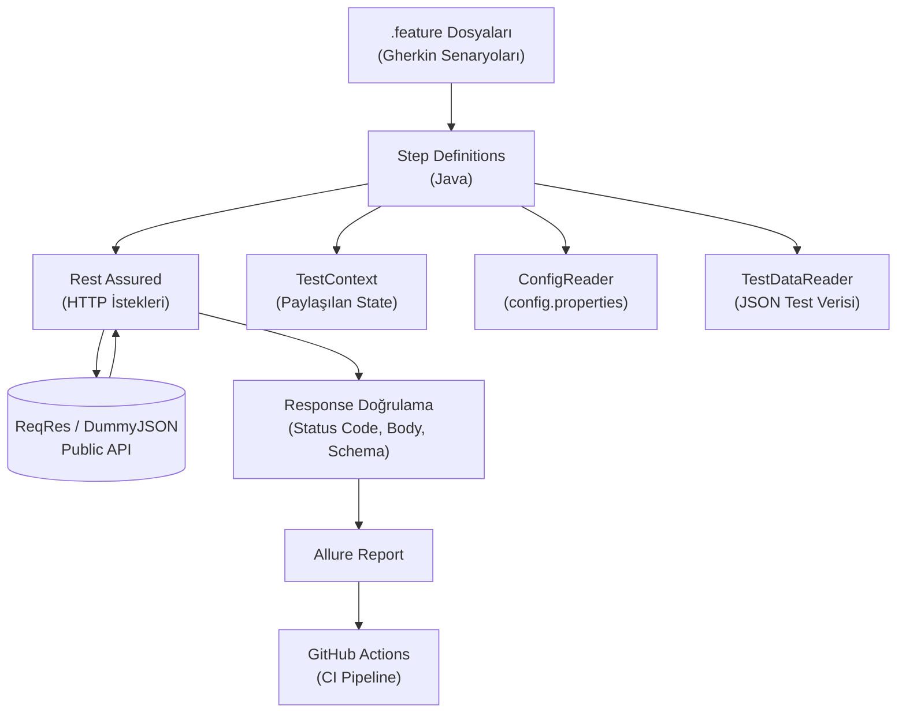

# API Test Automation Project | Rest Assured + Cucumber + JUnit 5

[]()
[]()
[]()

---

## 🇹🇷 Türkçe

### Proje Hakkında

Bu proje, **Java**, **Rest Assured**, **Cucumber** ve **JUnit 5** kullanılarak geliştirilmiş kapsamlı bir API test otomasyon framework'üdür. BDD (Behavior Driven Development) yaklaşımıyla, Gherkin dilinde yazılan senaryolar aracılığıyla [ReqRes](https://reqres.in) ve [DummyJSON](https://dummyjson.com) public API'leri üzerinde fonksiyonel, negatif ve performans (rate limiting) testleri gerçekleştirilmektedir.

### Kullanılan Teknolojiler

| Teknoloji | Amaç |
|---|---|
| Java 17 | Programlama dili |
| Maven | Bağımlılık ve build yönetimi |
| Rest Assured | API isteklerini gönderme ve doğrulama |
| Cucumber | BDD / Gherkin senaryo yönetimi |
| JUnit 5 | Test çalıştırma motoru |
| Jackson | JSON ↔ Java nesne dönüşümü |
| JSON Schema Validator | Response yapı/tip doğrulaması |
| Allure Report | Görsel test raporlama |
| GitHub Actions | CI/CD otomasyonu |

### Proje Mimarisi



### Klasör Yapısı
src/test/java
├── models/ # POJO sınıfları (User, UpdateUserRequest)
├── stepdefinitions/ # Gherkin step tanımları
├── runners/ # Cucumber + JUnit bağlantı sınıfı
└── utils/ # ConfigReader, TestDataReader

src/test/resources
├── features/ # .feature dosyaları
├── schemas/ # JSON Schema dosyaları
├── testdata/ # Test verisi (JSON)
└── config.properties # Ortam/URL yapılandırması


### Kapsanan Test Senaryoları

- ✅ CRUD işlemleri (GET, POST, PUT, DELETE)
- ✅ Negatif test senaryoları (404 Not Found)
- ✅ JSON Schema doğrulama (response yapı/tip kontrolü)
- ✅ Rate limiting (429) senaryosu
- ✅ Dinamik test verisi yönetimi (JSON dosyalarından okuma)
- ✅ Ortam bazlı konfigürasyon yönetimi

### Projeyi Çalıştırma

```bash
mvn test
```

Testler çalıştıktan sonra görsel rapor için:

```bash
allure serve target/allure-results
```

### Öğrenilen Önemli Bir Ders

Proje geliştirme sürecinde, Türkçe sistem dili (`tr_TR`) kullanan makinelerde Rest Assured'ın 4xx/5xx status code'larında beklenmedik `HttpResponseException` fırlattığı tespit edildi. Bu, Java'nın ünlü ["Turkish-i" locale hatası](https://github.com/rest-assured/rest-assured/issues/1534)ndan kaynaklanıyor (`"FAILURE".toLowerCase()` → `"faılure"`). Çözüm olarak JVM varsayılan dili test başlamadan önce İngilizce'ye ayarlandı.

### İletişim

- GitHub: [github.com/SeymaDeveci](https://github.com/SeymaDeveci)
- Medium: [medium.com/@seyma.devop](https://medium.com/@seyma.devop)

---

## 🇬🇧 English

### About the Project

This project is a comprehensive API test automation framework built with **Java**, **Rest Assured**, **Cucumber**, and **JUnit 5**. Following the BDD (Behavior Driven Development) approach, test scenarios are written in Gherkin and executed against the [ReqRes](https://reqres.in) and [DummyJSON](https://dummyjson.com) public APIs, covering functional, negative, and performance (rate limiting) testing.

### Tech Stack

| Technology | Purpose |
|---|---|
| Java 17 | Programming language |
| Maven | Dependency & build management |
| Rest Assured | Sending/validating API requests |
| Cucumber | BDD / Gherkin scenario management |
| JUnit 5 | Test execution engine |
| Jackson | JSON ↔ Java object mapping |
| JSON Schema Validator | Response structure/type validation |
| Allure Report | Visual test reporting |
| GitHub Actions | CI/CD automation |

### Test Coverage

- ✅ CRUD operations (GET, POST, PUT, DELETE)
- ✅ Negative test scenarios (404 Not Found)
- ✅ JSON Schema validation
- ✅ Rate limiting (429) scenario
- ✅ Dynamic test data management (reading from JSON files)
- ✅ Environment-based configuration management

### Running the Project

```bash
mvn test
```

To view the visual report:

```bash
allure serve target/allure-results
```

### A Notable Learning Experience

During development, a locale-dependent bug was discovered: on machines with the Turkish system locale (`tr_TR`), Rest Assured threw unexpected `HttpResponseException`s on 4xx/5xx status codes. This turned out to be caused by Java's well-known ["Turkish-i" locale bug](https://github.com/rest-assured/rest-assured/issues/1534) (`"FAILURE".toLowerCase()` → `"faılure"` in Turkish locale). The fix was to set the JVM's default locale to English before test execution.

### Contact

- GitHub: [github.com/SeymaDeveci](https://github.com/SeymaDeveci)
- Medium: [medium.com/@seyma.devop](https://medium.com/@seyma.devop)